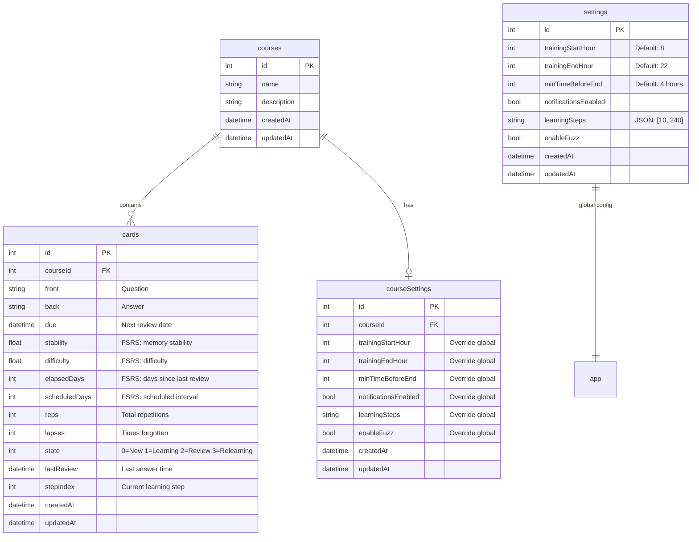
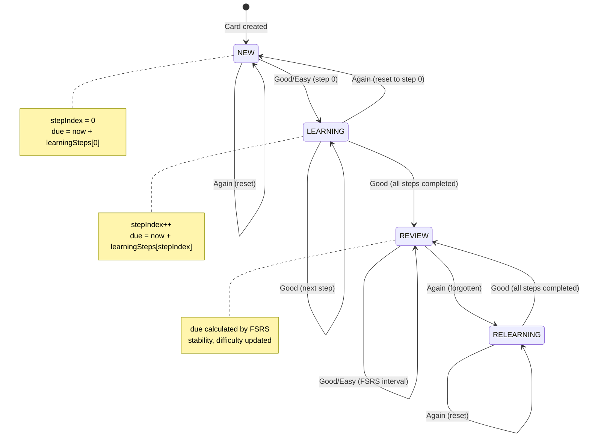
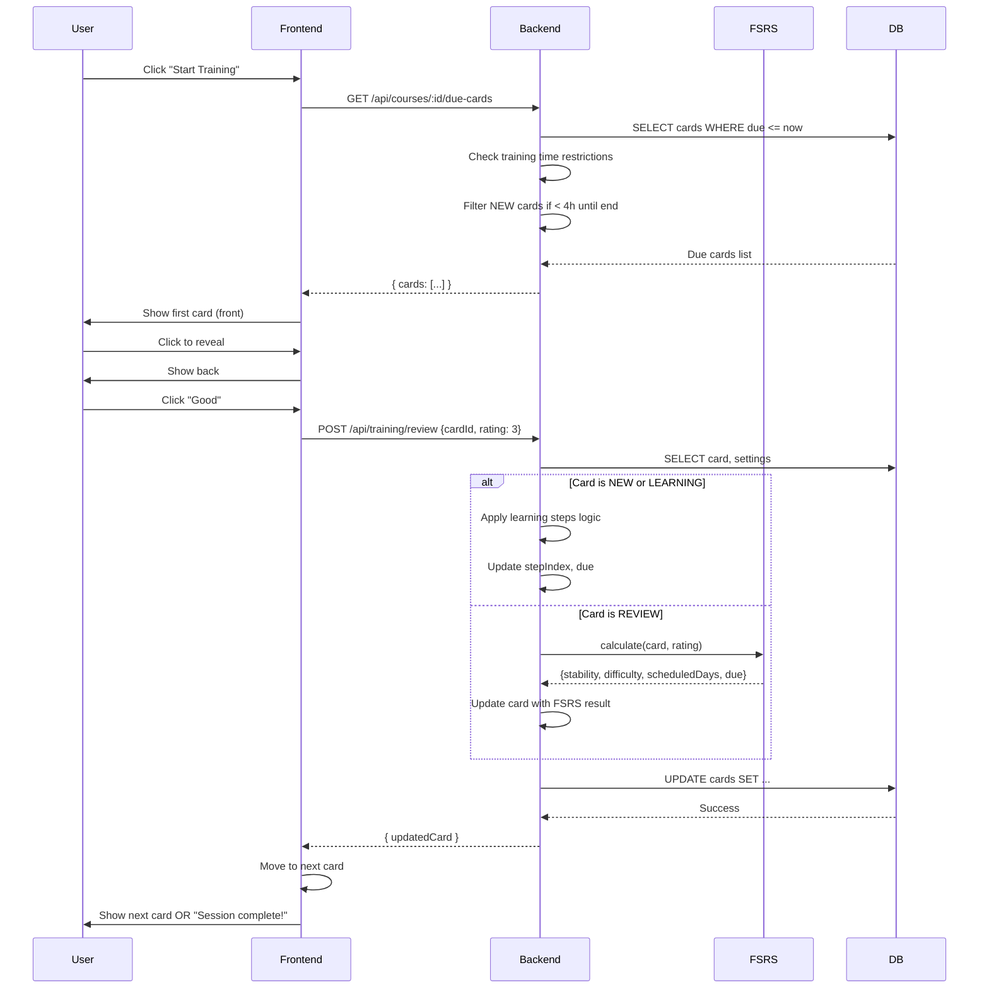
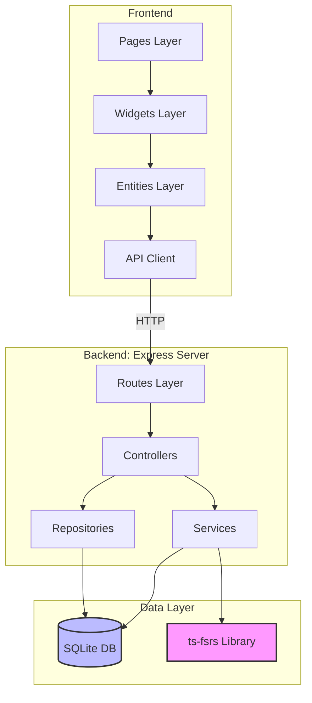
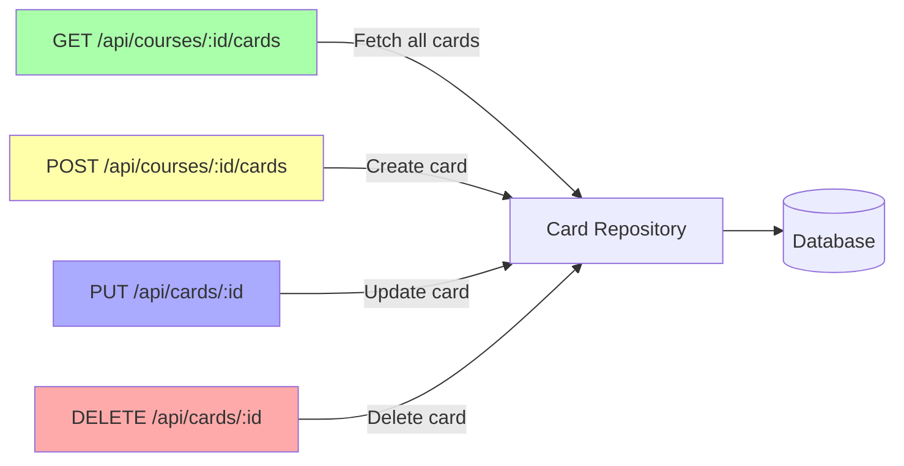
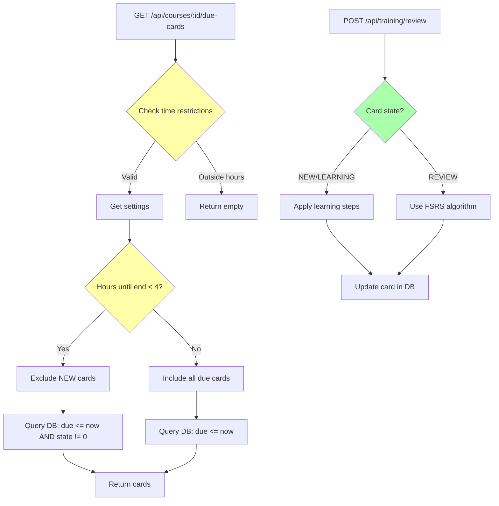
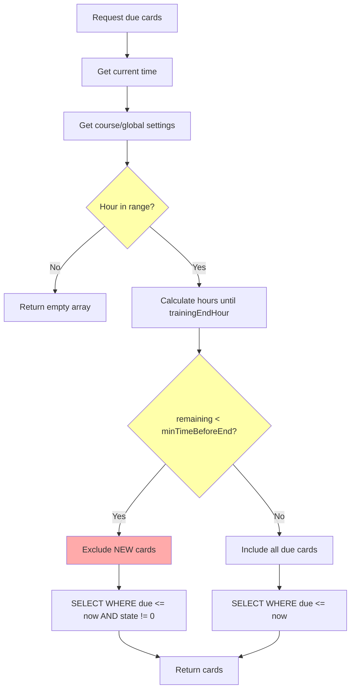
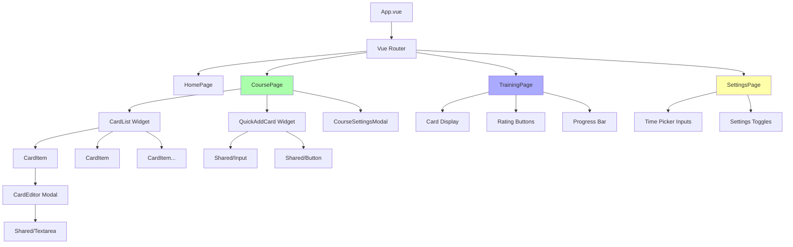
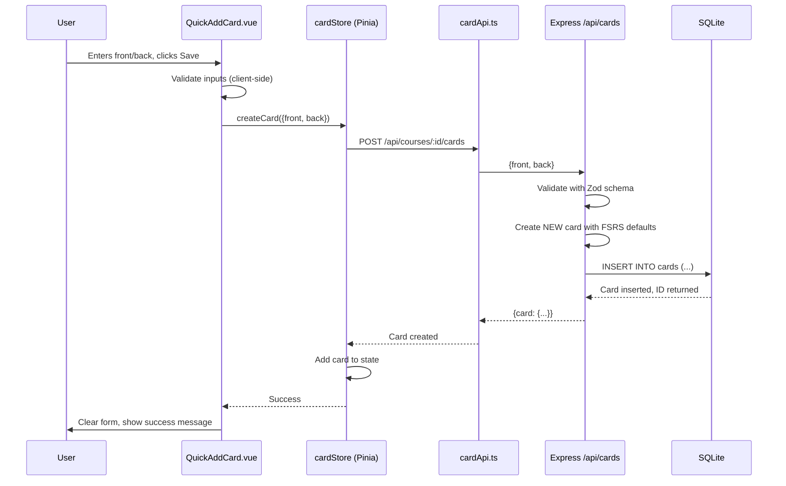
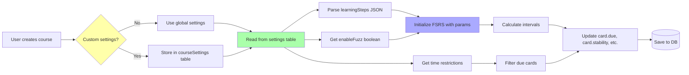

# Architecture Visualization: Cards and FSRS

## Database Schema



---

## Card State Machine (FSRS Flow)



---

## Training Flow (User Journey)



---

## API Architecture



---

## Key API Endpoints

### Cards CRUD



### Training Flow



---

## Learning Steps Logic

```mermaid
flowchart TD
    Start[User answers card] --> CheckState{Card state?}
    CheckState -->|NEW or LEARNING| GetSteps[Get learning steps from settings]
    CheckState -->|REVIEW| UseFSRS[Use FSRS calculation]
    GetSteps --> CheckRating{User rating?}
    CheckRating -->|AGAIN| ResetStep[stepIndex = 0, lapses++]
    CheckRating -->|GOOD/EASY| IncStep[stepIndex++]
    ResetStep --> CalcDue1[due = now + steps[0]]
IncStep --> CheckComplete{stepIndex >= steps.length?}

CheckComplete -->|Yes|Transition[state = REVIEW, use FSRS]
CheckComplete -->|No|CalcDue2[due = now + steps[stepIndex]]

CalcDue1 --> SaveCard[Save to DB]
CalcDue2 --> SaveCard
Transition --> SaveCard
UseFSRS --> SaveCard

SaveCard --> End[Card updated]

style CheckRating fill: #ffa
style CheckComplete fill: #afa
style Transition fill: #aaf
```

---

## Time Restrictions Logic



---

## Component Hierarchy (Frontend)



---

## Data Flow: Creating a Card



---

## FSRS Parameters Flow



---

## Notes

> **Database Schema**: All FSRS-specific fields are required for the algorithm to work correctly.

> **State Machine**: Transitions between card states are strictly defined by the FSRS algorithm.

> **Time Restrictions**: Critical for user experience — must not offer NEW cards if < 4 hours until end of day.

> **Learning Steps**: Custom logic that works BEFORE the card enters the full FSRS cycle.
