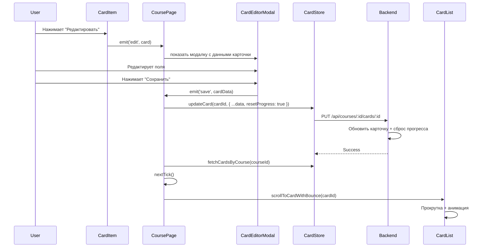
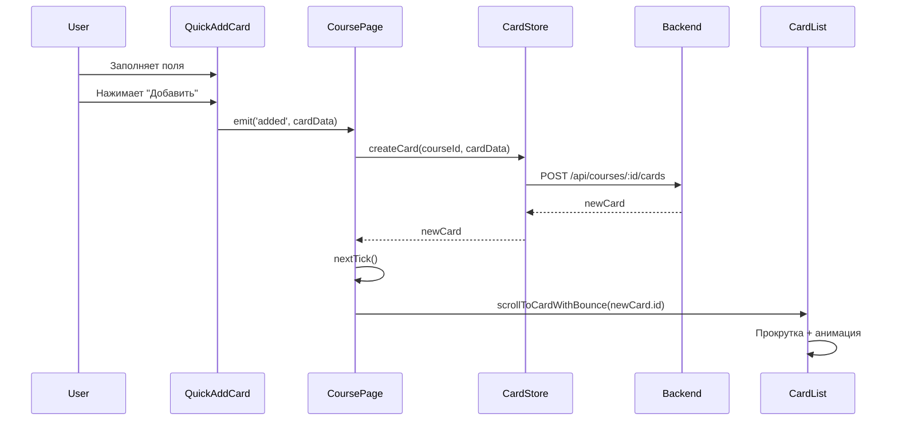

# Design: Card Edit Visual Feedback

## Overview

Данное изменение расширяет функционал редактирования и добавления карточек визуальной обратной связью
(прокрутка + анимация) для улучшения UX. Ключевые особенности:

1. **Использование существующей модалки** — `CardEditorModal` уже исправлена и готова к использованию
2. **Сброс прогресса карточки** — при сохранении изменений карточка становится новой
3. **Визуальная обратная связь** — прокрутка к отредактированной/добавленной карточке + `bounce-in-bck`
   анимация
4. **Простая интеграция** — минимальные изменения в `CoursePage` и `CardList`

---

## Components

### 1. CardList.vue (изменения)

**Путь**: `frontend/src/widgets/card-list/CardList.vue`

**Новый метод**:

```typescript
const scrollToCardWithBounce = (cardId: string) => {
  const cardElement = scrollContainer.value?.querySelector(`[data-card-id="${cardId}"]`)
  
  if (!cardElement) {
    console.warn(`Card with id ${cardId} not found in list`)
    return
  }
  
  // Прокручиваем к карточке
  cardElement.scrollIntoView({ behavior: 'smooth', block: 'start' })
  
  // Добавляем класс анимации
  setTimeout(() => {
    cardElement.classList.add('anim-bounce-in-bck')
    
    // Удаляем класс после завершения анимации
    setTimeout(() => {
      cardElement.classList.remove('anim-bounce-in-bck')
    }, 2000)
  }, 500) // Задержка перед анимацией, чтобы прокрутка завершилась
}

// Экспортируем метод через defineExpose
defineExpose({
  scrollToCardWithBounce
})
```

**Template изменения**:

```vue
<CardItem
  class="snap-start flex-[0_0_210px] z-5"
  v-for="card in cards"
  :key="card.id"
  :card="card"
  :data-card-id="card.id"
  @edit="handleEdit"
  @delete="handleDelete"
/>
```

**CSS добавление**:

```css
.anim-bounce-in-bck {
  animation-duration: 1s;
  animation-name: bounce-in-bck;
}

@keyframes bounce-in-bck {
  0% {
    opacity: 0;
    animation-timing-function: ease-in;
    transform: scale(7);
  }
  38% {
    opacity: 1;
    animation-timing-function: ease-out;
    transform: scale(1);
  }
  55% {
    animation-timing-function: ease-in;
    transform: scale(1.5);
  }
  72%, 89%, to {
    animation-timing-function: ease-out;
    transform: scale(1);
  }
  81% {
    animation-timing-function: ease-in;
    transform: scale(1.24);
  }
  95% {
    animation-timing-function: ease-in;
    transform: scale(1.04);
  }
}

@media (prefers-reduced-motion: reduce) {
  .anim-bounce-in-bck {
    animation: none;
  }
}
```

---

### 2. CoursePage.vue (изменения)

**Новый ref**:

```typescript
const cardListRef = ref(null)
```

**Изменённые обработчики**:

#### handleSaveCard (изменённый)

```typescript
const handleSaveCard = async (data) => {
  try {
    if (editingCard.value) {
      // Режим редактирования
      await cardStore.updateCard(editingCard.value.id, { ...data, resetProgress: true })
      const editedCardId = editingCard.value.id
      
      // Обновляем список карточек
      await cardStore.fetchCardsByCourse(courseId)
      
      // Прокручиваем к отредактированной карточке с анимацией
      nextTick(() => {
        scrollToCardWithBounce(editedCardId)
      })
    }
    else {
      // Режим создания
      await cardStore.createCard(courseId, data)
    }
    handleCloseModal()
  }
  catch (err) {
    console.error('Failed to save card:', err)
  }
}
```

#### handleQuickAdd (изменённый)

```typescript
const handleQuickAdd = async (cardData: { front: string; back: string }) => {
  try {
    const newCard = await cardStore.createCard(courseId, cardData)
    
    // Прокручиваем к добавленной карточке с анимацией
    nextTick(() => {
      scrollToCardWithBounce(newCard.id)
    })
  }
  catch (err) {
    console.error('Failed to create card:', err)
  }
}
```

#### scrollToCardWithBounce (новый)

```typescript
const scrollToCardWithBounce = (cardId: string) => {
  const cardListComponent = cardListRef.value
  if (cardListComponent) {
    cardListComponent.scrollToCardWithBounce(cardId)
  }
}
```

**Template изменения**:

```vue
<!-- Desktop cards list -->
<CardList
  ref="cardListRef"
  :cards="cards"
  :loading="cardsLoading"
  @edit="handleEditCard"
  @delete="handleDeleteCard"
/>

<!-- Mobile cards list (inside panel) -->
<CardList
  ref="cardListRef"
  class="panel-content flex-1 pl-[10px]"
  :cards="cards"
  :loading="cardsLoading"
  @edit="handleEditCard"
  @delete="handleDeleteCard"
/>
```

**Примечание**: На странице два экземпляра `CardList` (desktop и mobile). Для корректной работы нужно
использовать один и тот же ref. В текущей реализации на mobile используется отдельный `CardList` внутри панели,
поэтому ref может ссылаться на видимый экземпляр. Альтернативно, можно использовать отдельные refs для desktop
и mobile и вызывать метод для соответствующего экземпляра в зависимости от `isDesktop.value`.

---

## API Changes

### Endpoint: PUT /api/courses/:courseId/cards/:cardId

**Текущее состояние**: Endpoint должен существовать (проверить в `backend/src/routes/cards.ts`)

**Требуемое тело запроса**:

```typescript
interface UpdateCardRequest {
  front: string
  back: string
  resetProgress?: boolean // Флаг сброса прогресса
}
```

**Логика сброса прогресса** (если `resetProgress === true`):

- `state` → `CardState.New`
- `stability` → `null`
- `difficulty` → `null`
- `reps` → 0
- `lapses` → 0
- `lastReview` → `null`
- `due` → текущее время + первый интервал повторения (4 часа)
- `interval` → `null`

**Изменения в route**:

Файл: `backend/src/routes/cards.ts`

```typescript
router.put('/courses/:courseId/cards/:cardId', async (req, res) => {
  const { courseId, cardId } = req.params
  const { front, back, resetProgress } = req.body
  
  const updates: Partial<Card> = { front, back }
  
  if (resetProgress) {
    Object.assign(updates, {
      state: CardState.New,
      stability: null,
      difficulty: null,
      reps: 0,
      lapses: 0,
      lastReview: null,
      due: new Date(Date.now() + 4 * 60 * 60 * 1000).toISOString(),
      interval: null,
    })
  }
  
  const updatedCard = await cardRepository.updateCard(cardId, updates)
  res.json(updatedCard)
})
```

---

## Data Flow

### Редактирование карточки



### Добавление карточки



---

## Edge Cases

### 1. Карточка не найдена в списке после сохранения

**Сценарий**: После сохранения карточки она не появляется в списке (например, из-за фильтрации или пагинации).

**Решение**:

- В `CardList.scrollToCardWithBounce()` проверяем наличие элемента
- Если элемент не найден, выводим warning в консоль
- Не бросаем исключение, чтобы не ломать UX

### 2. Два экземпляра CardList (desktop и mobile)

**Сценарий**: На странице два экземпляра `CardList` — один для desktop, один для mobile панели.

**Решение**:

- Использовать единый ref `cardListRef`, который будет ссылаться на видимый экземпляр
- Альтернативно: создать два отдельных ref (`cardListDesktopRef`, `cardListMobileRef`) и вызывать метод для
  соответствующего экземпляра в зависимости от `isDesktop.value`

### 3. Анимация запускается до завершения прокрутки

**Сценарий**: Анимация начинается сразу, но карточка ещё не прокручена до видимой области.

**Решение**:

- Добавлен `setTimeout` 500ms перед запуском анимации, чтобы прокрутка успела завершиться

---

## Testing Strategy

### Manual Testing Checklist

**Desktop (≥1025px)**:

- [ ] Нажатие "Редактировать" открывает модалку с данными карточки
- [ ] Редактирование и сохранение карточки обновляет её в списке
- [ ] После сохранения список прокручивается к отредактированной карточке
- [ ] Отредактированная карточка показывает bounce-анимацию
- [ ] Прогресс карточки сброшен (state = New, reps = 0, etc.)
- [ ] Добавление карточки через QuickAddCard прокручивает к ней
- [ ] Добавленная карточка показывает bounce-анимацию

**Mobile (<1025px)**:

- [ ] Редактирование карточки работает аналогично desktop
- [ ] После сохранения список прокручивается к отредактированной карточке
- [ ] Bounce-анимация работает
- [ ] При прокрутке mobile панель не закрывается автоматически

**Edge Cases**:

- [ ] Если карточка не найдена в списке, warning в консоли
- [ ] Анимация уважает `prefers-reduced-motion: reduce`
- [ ] Прокрутка работает для карточки в начале/середине/конце списка

---

## Performance Considerations

1. **Прокрутка к элементу**: `scrollIntoView({ behavior: 'smooth' })` может быть медленной на длинных списках.
   Решение: ограничить количество карточек в DOM (виртуальная прокрутка — out of scope для этого изменения)

2. **Анимация**: CSS-анимация `bounce-in-bck` выполняется через GPU (transform + opacity), поэтому не создаёт
   нагрузки на CPU

3. **Запросы к API**: При сохранении карточки отправляется только один запрос
   `PUT /api/courses/:id/cards/:id`. Обновление списка происходит через `fetchCardsByCourse()`, который уже
   кэшируется в store

---

## Accessibility

1. **Анимация**: `bounce-in-bck` уважает `prefers-reduced-motion`:

   ```css
   @media (prefers-reduced-motion: reduce) {
     .anim-bounce-in-bck {
       animation: none;
     }
   }
   ```

2. **Прокрутка**: `scrollIntoView` доступна для screen readers (не влияет на фокус)

---

## Summary

Это изменение добавляет минимальную визуальную обратную связь при редактировании и добавлении карточек:

1. **Прокрутка** к отредактированной/добавленной карточке
2. **Bounce-анимация** для выделения карточки
3. **Сброс прогресса** при редактировании (карточка становится новой)

Реализация проста и не требует новых компонентов — используется существующая `CardEditorModal`.
