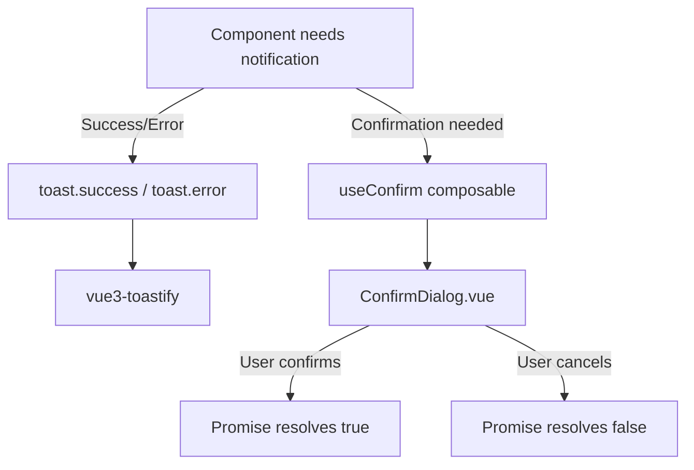

# Design: Replace System Dialogs with Custom UI

## Architecture Overview

Замена системных диалогов на кастомные UI компоненты осуществляется двумя способами:

1. **Toast Notifications** (`vue3-toastify`) — для простых уведомлений (success/error/info)
2. **ConfirmDialog** (кастомный компонент) — для подтверждающих диалогов



---

## Component 1: Toast Notifications (vue3-toastify)

### Установка и настройка

**Библиотека**: `vue3-toastify@^0.2.8` (уже установлена в package.json)

**Глобальная инициализация** в `frontend/src/app/main.ts`:

```typescript
import {createApp} from 'vue';
import {toast, type ToastContainerOptions} from 'vue3-toastify';
import 'vue3-toastify/dist/index.css';

const app = createApp(App);

// Опционально: настройка глобальных параметров
const toastOptions: ToastContainerOptions = {
  position: 'top-right',
  autoClose: 3000,
  hideProgressBar: false,
  closeOnClick: true,
  pauseOnHover: true,
  draggable: true,
  theme: 'auto', // auto определяет тему по prefers-color-scheme
};

app.mount('#app');
```

### Использование

В любом компоненте импортируем `toast`:

```typescript
import {toast} from 'vue3-toastify';

// Success notification
toast.success('Глобальные настройки сохранены!');

// Error notification
toast.error('Ошибка сохранения: ' + error.message);

// Info notification
toast.info('Информация');

// Warning notification
toast.warn('Предупреждение');
```

### Стилизация

vue3-toastify поддерживает автоматическую смену темы через `theme: 'auto'`, которая адаптируется к
`prefers-color-scheme` браузера. Поскольку в проекте уже настроена тема через Tailwind CSS, тосты будут автоматически
соответствовать текущей теме приложения.

Если потребуется дополнительная кастомизация, можно переопределить CSS переменные в `frontend/src/app/styles/main.css`:

```css
:root {
    --toastify-color-success: var(--color-success);
    --toastify-color-error: var(--color-danger);
    --toastify-color-warning: var(--color-warning);
    --toastify-color-info: var(--color-info);
}
```

---

## Component 2: ConfirmDialog

### Архитектура

**Компонент**: `frontend/src/shared/ui/ConfirmDialog.vue`  
**Composable**: `frontend/src/shared/lib/useConfirm.js`

### Технические детали

#### ConfirmDialog.vue

Кастомный модальный компонент с анимациями и поддержкой темизации.

**Props:**

| Prop          | Type                       | Required | Default | Description                                    |
|---------------|----------------------------|----------|---------|------------------------------------------------|
| `title`       | `string`                   | Yes      | —       | Заголовок диалога                              |
| `message`     | `string`                   | Yes      | —       | Текст сообщения                                |
| `confirmText` | `string`                   | No       | `"Да"`  | Текст кнопки подтверждения                     |
| `cancelText`  | `string`                   | No       | `"Нет"` | Текст кнопки отмены                            |
| `resolve`     | `(value: boolean) => void` | Yes      | —       | Callback для разрешения промиса                |
| `close`       | `() => void`               | Yes      | —       | Callback для закрытия и уничтожения компонента |

**Structure:**

```vue

<script setup>
  import { onMounted, onUnmounted, ref } from 'vue';

  const props = defineProps({
                              title: String,
                              message: String,
                              confirmText: String,
                              cancelText: String,
                              resolve: Function,
                              close: Function,
                            });

  const isOpen = ref(false);

  // Анимация открытия
  onMounted(() => {
    isOpen.value = true;
  });

  const handleConfirm = () => {
    props.resolve(true);
    closeModal();
  };

  const handleCancel = () => {
    props.resolve(false);
    closeModal();
  };

  const closeModal = () => {
    isOpen.value = false;
    // Ждем конца анимации перед уничтожением
    setTimeout(props.close, 300);
  };
</script>

<template>
  <div v-if="isOpen" class="modal-backdrop" @click="handleCancel">
    <div class="modal-content" @click.stop>
      <h3 class="modal-title">{{ title }}</h3>
      <p class="modal-message">{{ message }}</p>
      <div class="modal-actions">
        <button @click="handleCancel" class="btn-secondary">
          {{ cancelText || 'Нет' }}
        </button>
        <button @click="handleConfirm" class="btn-primary">
          {{ confirmText || 'Да' }}
        </button>
      </div>
    </div>
  </div>
</template>

<style scoped>
  .modal-backdrop {
    position: fixed;
    inset: 0;
    z-index: 50;
    display: flex;
    align-items: center;
    justify-content: center;
    background: rgba(0, 0, 0, 0.5);
    animation: fadeIn 0.3s ease;
  }

  .modal-content {
    background: var(--color-background);
    color: var(--color-text);
    padding: 1.5rem;
    border-radius: 0.5rem;
    box-shadow: 0 20px 25px -5px rgba(0, 0, 0, 0.1), 0 10px 10px -5px rgba(0, 0, 0, 0.04);
    width: 24rem;
    max-width: 90vw;
    animation: slideIn 0.3s ease;
  }

  .modal-title {
    font-size: 1.125rem;
    font-weight: 700;
    margin-bottom: 0.5rem;
  }

  .modal-message {
    margin-top: 0.5rem;
    color: var(--color-text-muted);
    white-space: pre-wrap; /* Preserve newlines */
  }

  .modal-actions {
    margin-top: 1rem;
    display: flex;
    justify-content: flex-end;
    gap: 0.5rem;
  }

  @keyframes fadeIn {
    from {
      opacity: 0;
    }
    to {
      opacity: 1;
    }
  }

  @keyframes slideIn {
    from {
      opacity: 0;
      transform: translateY(-1rem);
    }
    to {
      opacity: 1;
      transform: translateY(0);
    }
  }
</style>
```

#### useConfirm.js Composable

**Location**: `frontend/src/shared/lib/useConfirm.js`

**API:**

```javascript
import { createVNode, render } from 'vue';
import ConfirmDialog from '@/shared/ui/ConfirmDialog.vue';

/**
 * Composable для программного вызова диалога подтверждения.
 *
 * @returns {object} - Объект с методом confirm
 */
export function useConfirm () {
    /**
     * Показывает диалог подтверждения и возвращает промис.
     *
     * @param {string | ConfirmOptions} options - Опции диалога или строка сообщения
     * @returns {Promise<boolean>} - Promise, который разрешается в true (подтверждение) или false (отмена)
     */
    const confirm = (options) => {
        return new Promise((resolve) => {
            const props = typeof options === 'string'
                          ? { message: options, title: 'Подтверждение' }
                          : { title: 'Подтверждение', ...options };

            // Создаем контейнер для монтирования
            const container = document.createElement('div');
            document.body.appendChild(container);

            // Функция очистки после закрытия
            const close = () => {
                render(null, container);
                document.body.removeChild(container);
            };

            // Создаем VNode с пробросом resolve и close
            const vnode = createVNode(ConfirmDialog, {
                ...props,
                resolve,
                close,
            });

            // Рендерим в контейнер
            render(vnode, container);
        });
    };

    return { confirm };
}
```

**Usage Example:**

```typescript
import {useConfirm} from '@/shared/lib/useConfirm';

const {confirm} = useConfirm();

// Simple usage with message string
const confirmed = await confirm('Вы уверены?');
if (confirmed) {
  // User clicked "Да"
}

// Advanced usage with options
const confirmed = await confirm({
  title: 'Удаление курса',
  message: 'Вы уверены, что хотите удалить курс "JavaScript"?',
  confirmText: 'Удалить',
  cancelText: 'Отмена',
});
```

---

## Migration Strategy

### Phase 1: Setup (Подготовка)

1. Настроить vue3-toastify в `main.ts`
2. Создать `ConfirmDialog.vue` в `shared/ui/`
3. Создать `useConfirm.js` в `shared/lib/`

### Phase 2: Replace alert() (4 files)

| File               | Line | Old Code                                       | New Code                                             |
|--------------------|------|------------------------------------------------|------------------------------------------------------|
| `SettingsPage.vue` | 48   | `alert('Глобальные настройки сохранены!')`     | `toast.success('Глобальные настройки сохранены!')`   |
| `SettingsPage.vue` | 50   | `alert('Ошибка сохранения: ' + error.message)` | `toast.error('Ошибка сохранения: ' + error.message)` |
| `HomePage.vue`     | 40   | `alert('Ошибка при удалении курса...')`        | `toast.error('Ошибка при удалении курса...')`        |
| `HomePage.vue`     | 58   | `alert('Ошибка при сохранении курса...')`      | `toast.error('Ошибка при сохранении курса...')`      |

### Phase 3: Replace confirm() (5 files)

| File                      | Line | Old Code                                                                 | New Code                                                                                           |
|---------------------------|------|--------------------------------------------------------------------------|----------------------------------------------------------------------------------------------------|
| `CourseSettingsModal.vue` | 81   | `if (confirm('Сбросить настройки к глобальным?'))`                       | `const confirmed = await useConfirm().confirm('Сбросить настройки к глобальным?'); if (confirmed)` |
| `HomePage.vue`            | 34   | `const confirmed = confirm(\`Вы уверены...\`)`                           | `const confirmed = await useConfirm().confirm({...})`                                              |
| `CoursePage.vue`          | 117  | `const confirmed = confirm('Удалить карточку?')`                         | `const confirmed = await useConfirm().confirm('Удалить карточку?')`                                |
| `CoursePage.vue`          | 142  | `const confirmed = confirm(\`Удалить выбранные карточки (\${count})?\`)` | `const confirmed = await useConfirm().confirm({...})`                                              |
| `CoursePage.vue`          | 156  | `const confirmed = confirm(\`Вы уверены...\`)`                           | `const confirmed = await useConfirm().confirm({...})`                                              |

Все методы обработчиков должны стать `async`, если они используют `await confirm()`.

---

## Testing Strategy

### Unit Tests

- Тестирование `useConfirm` composable
- Проверка что промис разрешается в `true` при нажатии "Да"
- Проверка что промис разрешается в `false` при нажатии "Нет"

### Integration Tests

- Ручная проверка каждого из 9 мест использования диалогов
- Проверка анимаций открытия/закрытия ConfirmDialog
- Проверка стилизации toast в светлой и темной теме

### Manual Verification

1. Открыть SettingsPage → сохранить настройки → проверить что появляется toast
2. Открыть HomePage → удалить курс → проверить что появляется ConfirmDialog
3. Открыть CoursePage → удалить карточку → проверить ConfirmDialog
4. Проверить работу в темной теме

---

## Accessibility Considerations

### ConfirmDialog

- Использовать `role="dialog"` и `aria-modal="true"` на модальном окне
- Добавить `aria-labelledby` для заголовка
- Добавить `aria-describedby` для сообщения
- Добавить focus trap (фокус не должен выходить за пределы диалога)
- Закрытие по Escape

### Toast Notifications

vue3-toastify уже имеет встроенную поддержку ARIA attributes.

---

## Color Scheme & Styling Tokens

Используются существующие CSS переменные из дизайн-системы проекта:

- `--color-background` — фон модального окна
- `--color-text` — основной текст
- `--color-text-muted` — второстепенный текст
- `.btn-primary` — кнопка подтверждения
- `.btn-secondary` — кнопка отмены

Эти переменные автоматически адаптируются к светлой и темной теме через Tailwind CSS.
